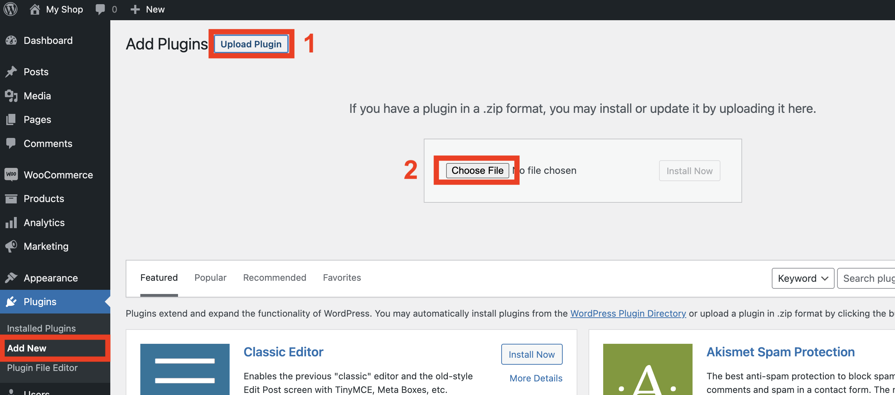
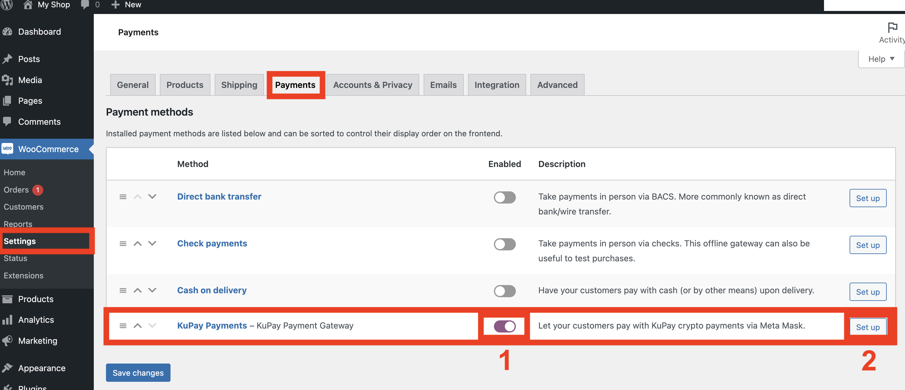

# Setup WooCommerce

#### Requirements/ limitations:

1. Requires a KuPay merchant account
2. Only works with **USD** currency at the moment. Please contact us to request another currency.
3. Only in **English** language
4. Tested on WordPress 5.9.3 and WooCommerce 6.3.0 and above
5. Requires PHP 7.0 or above

## The basics

1. Sign up for a new Merchant account on [https://kupay.finance/checkout](https://kupay.finance/checkout)
2. When you have access to the merchant panel, you will find your API key on the **Integrations** page
3. Install the plugin in your WooCommerce website
4. Enable the payment method
5. Enter your API key
6. Place a test order to check that everything goes well

### 3. Install the plugin

You can download the plugin as a .zip file in your merchant panel on the Integrations page.

You can then upload that same .zip file on your website.

### 4. Enable the payment method

Go to WooCommerce > Settings > Payments and click the switch to enable the KuPay payment method. Then click Set up.

### 5. Enter API Key

Go to WooCommerce > Settings > Payments and click **Set up** (or **Manage** if you did this before).

Now you can enter the API Key that you found in your KuPay Merchant panel.

## Upgrading

Once the KuPay WooCommerce plugin is on the WordPress repo, upgrading will be a simple click.

Until then, please follow these instructions:

1. Download the latest version of the plugin via your KuPay merchant panel
2. Log in to your WordPress admin panel
3. Go to the list of plugins
4. Deactivate-then-delete the KuPay plugin (do not worry, the API key and other details remain)
5. Add new plugin, upload the latest version
6. Check new settings and follow instructions if there are any
7. Check that everything works well, by placing a test order
